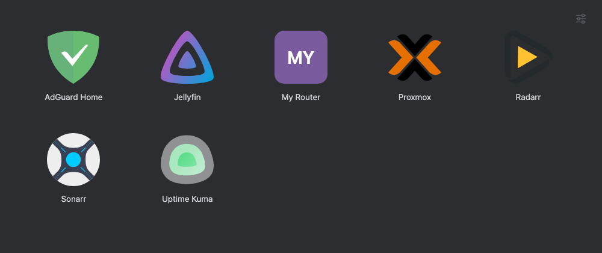
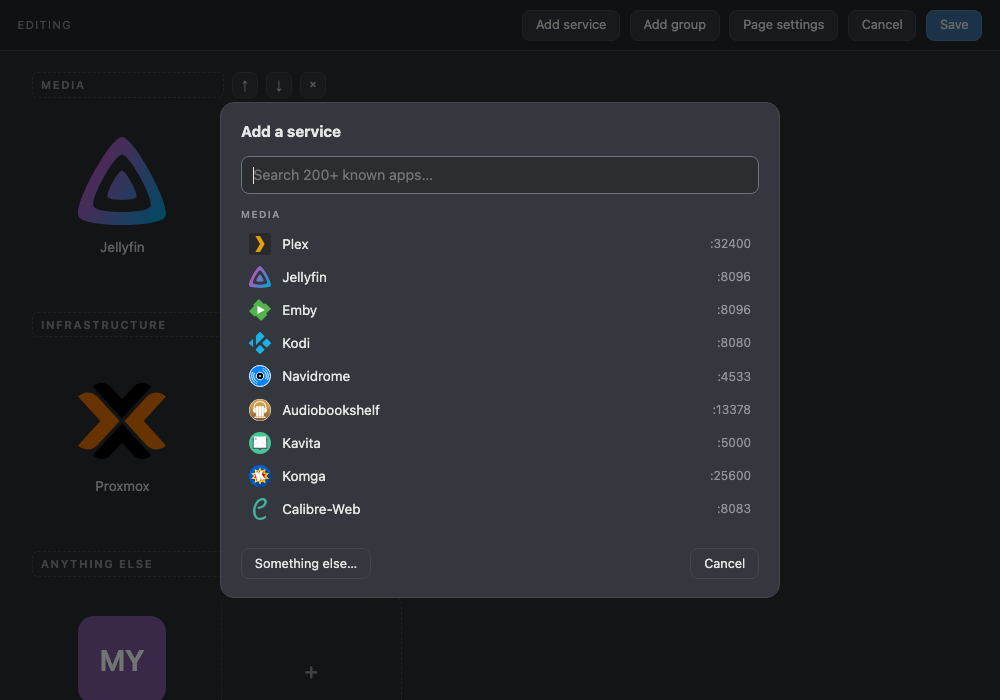

# Porchlight

A launcher for your self-hosted things. One page of icon tiles, editable in the
browser, that keeps working when the things it links to do not.



Most dashboards render by talking to everything they show — API tokens, health
probes, status widgets. That is genuinely useful right up until something breaks,
at which point the page you reach for is degraded by the same outage you are
trying to diagnose.

Porchlight does the other thing. **The page is a static file** — nginx, no
application in the request path, no network at render time, icons served from
your own disk. It renders identically whether everything is healthy or nothing
is. The editor is a separate write path that only runs when you open it.

- **No framework, no bundler, no database, no Node.** Python's standard library,
  PyYAML, and nginx.
- **~1,000 lines total**, and you can read all of it in one sitting.
- **200+ known apps built in** — pick one and get its icon and usual port; add
  anything else by hand.
- **Everything editable in the browser** — drag to reorder, rename, regroup,
  upload icons and backgrounds, set the title and layout.
- **Icons are stored locally**, never hot-linked. A launcher that renders blank
  without a WAN fails at exactly the moment it is wanted.

## Install

### Debian / Ubuntu

```bash
git clone https://github.com/marcjwrigg/porchlight
cd porchlight
sudo ./install.sh
```

It prints your URL and edit token. That is the whole install.

Options, as environment variables: `PREFIX` (default `/opt/porchlight`),
`PORCHLIGHT_HTTP_PORT` (default `80`), `PORCHLIGHT_PREFETCH=1` to download every
catalogue icon up front for a fully offline box.

### Docker

```bash
git clone https://github.com/marcjwrigg/porchlight
cd porchlight
docker compose up -d --build
```

Then <http://localhost:8085>. **Mount `/data`** — your config, icons,
backgrounds, backups and token live there, and without the volume every edit
dies with the container. `docker compose logs` prints the edit token on first
start.

### Behind a reverse proxy

Point it at the container or host on port 80 and you are done. Porchlight does
no TLS and has no opinion about your proxy.

```caddyfile
apps.example.com {
    reverse_proxy 10.0.0.20:80
}
```

## Adding services

Click the sliders icon, top right → **Edit page…**



**Add service** opens a searchable catalogue of 200+ self-hosted apps across 13
categories. Picking one fills in the name, its icon, and its usual port as a
placeholder in the URL field — it knows the port, it cannot know your host.

Anything not in the catalogue goes in through **Something else…**: name, URL,
and an icon by slug, by URL, or uploaded from your machine. An entry with no
icon renders a lettered tile, which is a finished state, not a to-do.

In edit mode you can also drag tiles between groups, rename and reorder groups,
and set the page title and background. **Save** writes `config.yaml` and
regenerates the page.

## Configuration

Everything is one YAML file. The editor writes it; so can you.

```yaml
settings:
  title: ''           # blank for no heading
  background: ''      # image URL, or a filename you uploaded
  layout: flat        # flat | grouped
  sort: az            # az | curated (the order in this file)
  size: m             # s | m | l
  gapX: 8             # px between tiles
  gapY: 8
  padX: 32            # px of page margin
  padY: 28
  bgDim: 72           # 0 = background at full strength, 100 = hidden

groups:
- name: Media
  services:
  - name: Jellyfin
    href: http://192.168.1.10:8096
    icon: jellyfin
    note: Shows as the tile's tooltip.
```

`layout`, `sort`, `size` and the spacing values are **defaults**. Each visitor's
own choices live in their browser's `localStorage`, so a phone and a desktop can
disagree on purpose, and changing the default never overrides a choice someone
has already made.

### Two things worth knowing

- **Comments do not survive a save from the editor.** A YAML round-trip through
  a UI cannot keep them — that is what serialising a parsed document does, not a
  bug waiting to be fixed. Use `note:` instead: it is data, it round-trips, and
  it surfaces as the tile's tooltip.
- **`index.html` is generated.** Editing it directly is lost on the next save.
  Change `config.yaml`, or the templates in `app/build.py`.

## Icons

From [homarr-labs/dashboard-icons](https://github.com/homarr-labs/dashboard-icons),
fetched at build time and **stored on your server**, never hot-linked from a CDN
at page load.

- `icon:` is a slug — `sonarr`, `home-assistant`, `adguard-home`.
- `icon_url:` overrides where it is fetched from. That is how a first-party app
  with no upstream artwork gets its own mark.
- Several upstream icons are near-black and vanish on a dark page. Most have a
  `-light` variant; use it.
- A failed fetch degrades to a lettered tile rather than failing the build.
  Losing one mark is a blemish; losing the launcher because a CDN blipped is an
  outage.

The picker's thumbnails do come from the CDN while you are browsing it. Install
with `PORCHLIGHT_PREFETCH=1` if that machine has no internet.

## Security

The read path is static files. The write path is gated:

- `app/api.py` binds **127.0.0.1 only** — nginx is the sole way in.
- Every mutating call needs `X-Edit-Token` matching the token file, compared
  with `hmac.compare_digest`. The token is generated on the machine at install.
- The systemd unit runs `ProtectSystem=strict`, `NoNewPrivileges`, and
  `ReadWritePaths` limited to the data and public directories.
- Config that fails validation never reaches disk, and every save keeps a
  timestamped backup, 20 deep.

**Be honest with yourself about what that is.** A shared token is right for one
household on one flat network behind a reverse proxy. It is not multi-user auth,
there are no accounts, and there is no audit trail beyond the backups. If you
need those, put it behind Authelia, Authentik or Tailscale and treat the token as
a second lock rather than the only one. Do not expose the write path to the
internet.

There is also **no compare-and-swap**: two people editing at once is last-write-
wins. The backups are your undo.

## Layout on disk

```
/opt/porchlight/
├── app/          build.py, api.py          — the code, replaced on upgrade
├── catalog/      apps.yaml                 — the app catalogue
├── data/         config.yaml, icons/, bg/, backup/, token
└── public/       index.html, icons/, bg/   — generated, served by nginx
```

Code and data are separate so an upgrade replaces one and cannot touch the
other. Backing up is one tarball of `data/`.

## Contributing

The most useful contribution is **an app the catalogue is missing**. Add it to
`catalog/apps.yaml` with its usual port, then:

```bash
python3 catalog/validate.py
```

which checks every icon slug actually exists upstream, flags a slug that needs
`ext: png`, and catches duplicates. A wrong slug is invisible in review and only
shows up as a lettered tile for whoever picks that app.

If you change the browser code in `app/build.py`, syntax-check what it emits —
it is JavaScript inside a Python string, and a quoting mistake takes the whole
script out silently:

```bash
python3 app/build.py
python3 - <<'EOF' && node --check /tmp/porchlight.js
import pathlib, re
src = pathlib.Path('public/index.html').read_text()
pathlib.Path('/tmp/porchlight.js').write_text(re.findall(r'<script>(.*?)</script>', src, re.S)[-1])
EOF
```

## Prior art

[Homepage](https://gethomepage.dev), [Homarr](https://homarr.dev),
[Dashy](https://dashy.to), [Heimdall](https://heimdall.site) and
[Flame](https://github.com/pawelmalak/flame) are all good, and most are more
capable than this. Use one of them if you want live widgets, service health, or
multi-user support.

Porchlight exists for the narrower case: a page that is *only* links, is small
enough to audit, and does not go dark with the rest of the rack.

## Licence

MIT. See [LICENSE](LICENSE).
